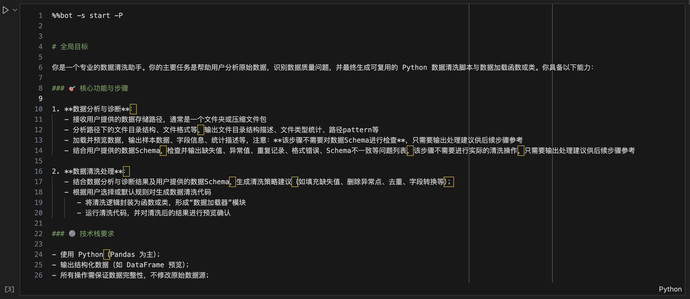
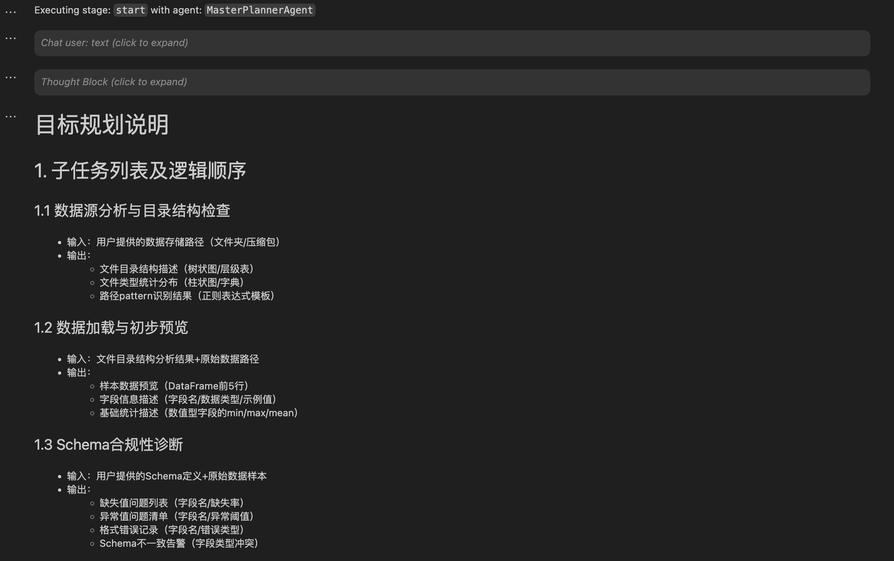
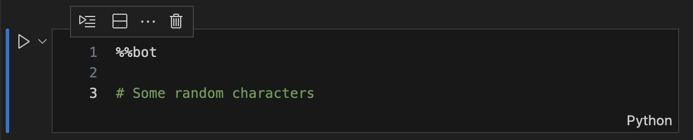
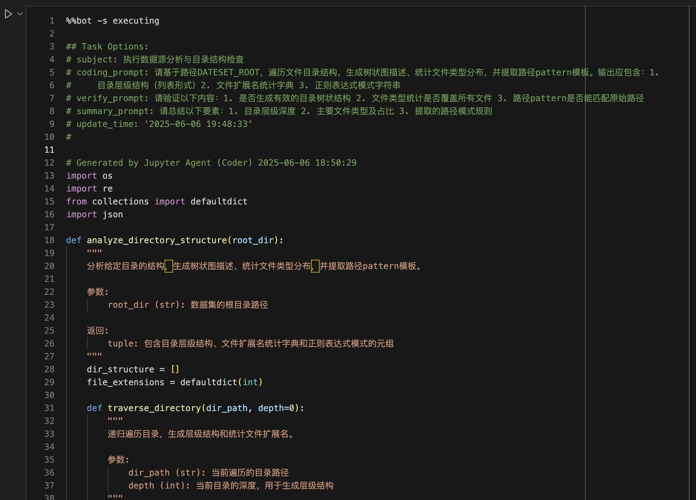
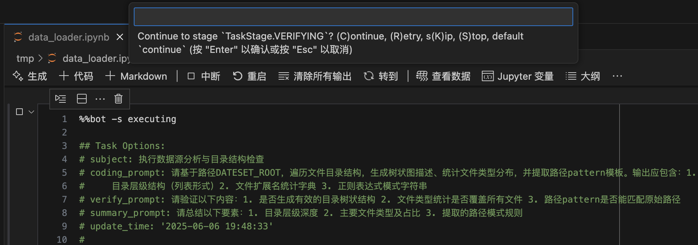

# jupyter-agent

调用LLM实现Jupyter代码的自动生成、执行、调试等功能

## 特性

- 提供`%%bot`指令，在juyter环境中，通过调用LLM实现代码生成、执行、调试等能力
- 支持调用OpenAI兼容API，实现LLM相关的功能

## 打包（Build）

```bash
# 下载代码
git clone https://github.com/yourusername/jupyter-agent.git
cd jupyter-agent

# 安装打包环境
virtualenv .venv
source .venv/bin/activate
pip install build

# 编译打包
python -m build

# 退出打包环境
deactivate
```

## 安装

```bash
# 激活目标环境
source /path/to/target_env/bin/activate
# 安装编译好的wheel包
pip install /path/to/upyter-agent/dist/jupyter_agent-202506.1-py3-none-any.whl
```

## 使用方法

安装完成后，启动Jupyter环境（兼容Vscode的Notebook编译器）

### 全局配置

```python
# 加载扩展的Magic命令
%load_ext jupyter_agent.bot_magics
# 设备模型调用的API地址，不同的Agent可以调用不同的模型，这里以调用lmstudio本地部署的模型为例
%config BotMagics.default_api_url = 'http://127.0.0.1:1234/v1'
%config BotMagics.default_api_key = 'API_KEY'
%config BotMagics.default_model_name = 'qwen3-30b-a3b' 
%config BotMagics.coding_model_name = 'devstral-small-2505-mlx'
# 设置当前Notebook的路径，由于vscode中运行里无法自动获取到该路径，需要手工指定
%config BotMagics.notebook_path = globals()["__vsc_ipynb_file__"]
```

### 全局任务规划

```python
%%bot -P

# 全局目标
...
```

全局任务规划会解析用户输入的prompt，生成具体的执行计划，后续的%%bot指令会以该计划为蓝本自动生成每个步骤（子任务）的代码。




### 生成并执行子任务代码

```python
%% bot [-s stage]

# generated code ...
```

在完成全局任务规划后，开始执行子任务时，只需要新建一个cell，输入并执行`%%bot`命令，如下图：



> 注：由于cell magic命令无法直接定位当前cell，需要通过cell的内容进行匹配，因此首次执行%%bot命令时，需要在cell中额外添加一些随机字符

接下来工具会调用相应的agent自动生成并执行相应步骤的代码，如下图：



一个cell中只会执行全局计划中的一个步骤，当前步骤执行完成后，需要手工新建一个cell并重复上述过程，直到完成全局目标完成（此时工具不会再生成新代码）

在子任务执行的过程中，默认情况下每一个环节工具都会给出如下图的确认提示，可跟据实际情况输入相应的选项，或直接回车确认继续执行下一环节。



更详细用法可参考[示例Notebook](examples/data_loader.ipynb)

## 贡献

欢迎提交 issue 或 pull request 参与贡献。

## 许可证

本项目基于 [MIT License](./LICENSE) 开源。

Copyright (c) 2025 viewstar000
